# Awesome Python Robotics [](https://awesome.re)

A curated list of awesome libraries, frameworks, simulators, tutorials, and overall resources for the robotics community using **Python**. Inspired by and structured after [awesome-matlab-robotics](https://github.com/mathworks-robotics/awesome-matlab-robotics) — same sections, Python ecosystem throughout.

**This repo also ships first-party Python implementations** of the major MATLAB demos as runnable Jupyter notebooks — **22 fully runnable examples** with embedded plots covering every major application area, plus **4 interactive pygame demos** you can drive in real time.

[](https://github.com/d8maldon/awesome-python-robotics/actions/workflows/notebooks.yml)

Contributions welcome. See [CONTRIBUTING.md](CONTRIBUTING.md). To track 1-for-1 coverage of the MATLAB source repo, see [TRACKING.md](TRACKING.md).

## Featured Demos

Animated GIFs from selected notebooks — click through to the full notebook with math + code.

> **⭐ Flagship notebooks**: **[05 Triple-Link LQR Pendulum](notebooks/05_motion_control_pendulum_lqr.ipynb)** (sympy.physics.mechanics → CARE → Lyapunov sublevel-set ROA verification on nonlinear dynamics) and **[20 SymPy Lagrangian Pendulum](notebooks/20_modeling_symbolic_pendulum.ipynb)** (Lagrangian derivation + RK4 integration + empirical energy conservation 10⁻⁸ + elliptic-integral period validation 1.072× linear). These are the strongest "math first, code second" demonstrations in the repo.

<table>
<tr>
<td width="50%" align="center">
<a href="notebooks/01_motion_planning_astar.ipynb">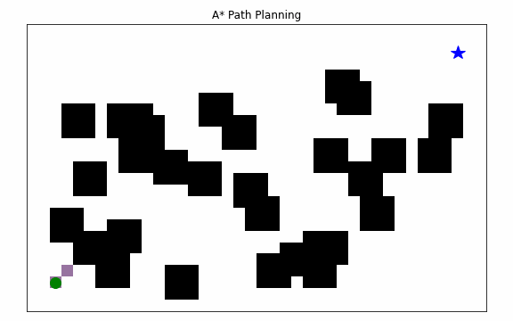</a><br>
<b><a href="notebooks/01_motion_planning_astar.ipynb">A* Path Planning</a></b><br>
<sub>Cells expand outward by f = g + h; optimal path drawn at the end.</sub>
</td>
<td width="50%" align="center">
<a href="notebooks/02_motion_planning_rrt.ipynb">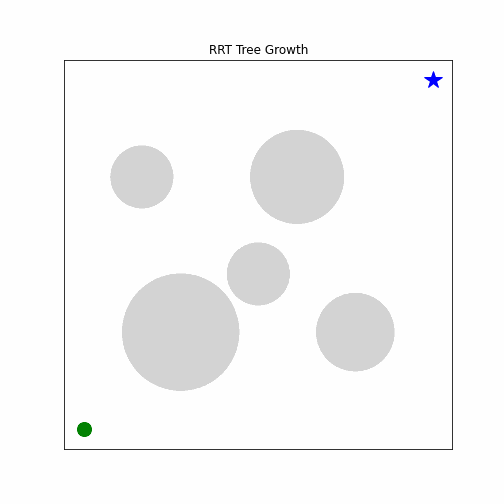</a><br>
<b><a href="notebooks/02_motion_planning_rrt.ipynb">RRT Tree Growth</a></b><br>
<sub>Rapidly-exploring random tree with 10% goal bias finds a path through 5 obstacles.</sub>
</td>
</tr>
<tr>
<td align="center">
<a href="notebooks/04_localization_particle_filter.ipynb">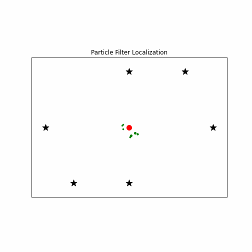</a><br>
<b><a href="notebooks/04_localization_particle_filter.ipynb">Particle Filter Localization</a></b><br>
<sub>600 particles collapse onto the true pose as range measurements arrive.</sub>
</td>
<td align="center">
<a href="notebooks/05_motion_control_pendulum_lqr.ipynb">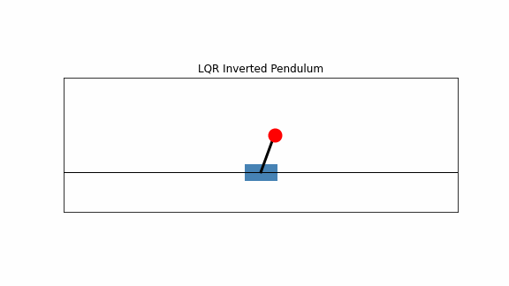</a><br>
<b><a href="notebooks/05_motion_control_pendulum_lqr.ipynb">LQR — Triple-Link Inverted Pendulum</a></b><br>
<sub>Three links, one cart force. 8-D state. Sympy derives the nonlinear EOMs; LQR balances all three simultaneously.</sub>
</td>
</tr>
<tr>
<td align="center">
<a href="notebooks/06_path_tracking_pure_pursuit.ipynb">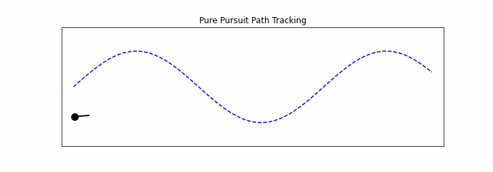</a><br>
<b><a href="notebooks/06_path_tracking_pure_pursuit.ipynb">Pure Pursuit Path Tracking</a></b><br>
<sub>Geometric controller chases a look-ahead point on a sinusoidal reference path.</sub>
</td>
<td align="center">
<a href="notebooks/08_uav_quadrotor_pid.ipynb">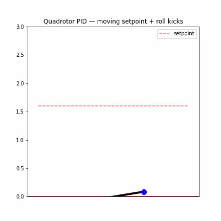</a><br>
<b><a href="notebooks/08_uav_quadrotor_pid.ipynb">Quadrotor PID</a></b><br>
<sub>Cascaded altitude + attitude PID rejects roll-axis disturbances while tracking a moving altitude setpoint.</sub>
</td>
</tr>
<tr>
<td align="center">
<a href="notebooks/07_manipulation_ik_2link.ipynb">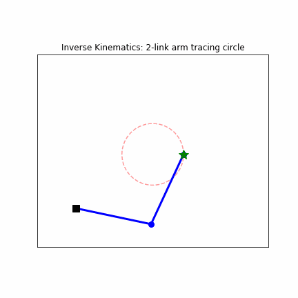</a><br>
<b><a href="notebooks/07_manipulation_ik_2link.ipynb">2-Link Inverse Kinematics</a></b><br>
<sub>Analytical IK solves for joint angles as the end-effector traces a circle.</sub>
</td>
<td align="center">
<a href="notebooks/11_slam_icp.ipynb">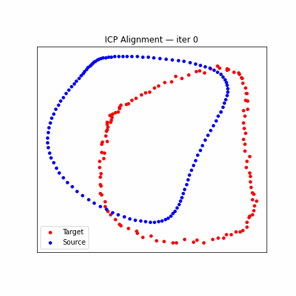</a><br>
<b><a href="notebooks/11_slam_icp.ipynb">ICP Scan Matching</a></b><br>
<sub>Iterative Closest Point converges the source point cloud onto the target in ~10 iterations.</sub>
</td>
</tr>
<tr>
<td align="center">
<a href="notebooks/22_motion_control_cbf_safety_filter.ipynb">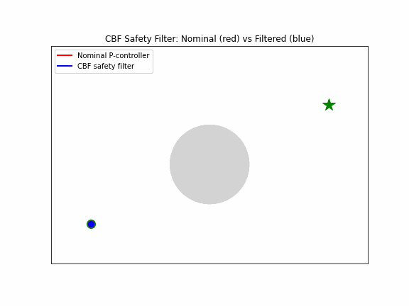</a><br>
<b><a href="notebooks/22_motion_control_cbf_safety_filter.ipynb">CBF Safety Filter</a></b><br>
<sub>Nominal P-controller (red) collides; CBF safety filter (blue) holds the forward-invariance boundary exactly. Nagumo 1942 / Ames 2014.</sub>
</td>
<td align="center">
<a href="notebooks/21_motion_control_mpc_cartpole.ipynb">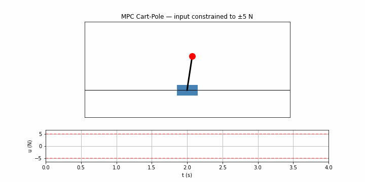</a><br>
<b><a href="notebooks/21_motion_control_mpc_cartpole.ipynb">MPC Cart-Pole</a></b><br>
<sub>Constrained MPC stabilizes cart-pole from 9° tilt with input saturated at ±5 N. Live control-input trace below.</sub>
</td>
</tr>
<tr>
<td align="center">
<a href="notebooks/12_slam_ekf_slam.ipynb">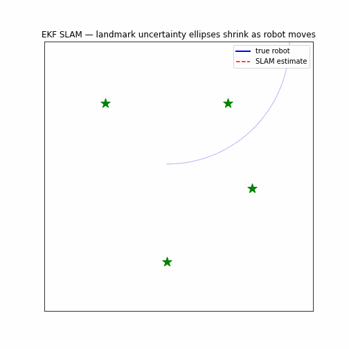</a><br>
<b><a href="notebooks/12_slam_ekf_slam.ipynb">EKF SLAM</a></b><br>
<sub>Robot trajectory + landmark uncertainty ellipses shrink as observations refine joint posterior. The covariance cross-correlations are SLAM's magic.</sub>
</td>
<td align="center">
<a href="notebooks/19_ground_vehicles_bicycle.ipynb">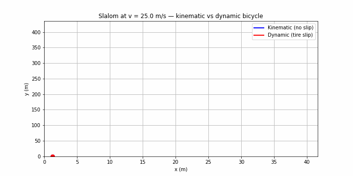</a><br>
<b><a href="notebooks/19_ground_vehicles_bicycle.ipynb">Bicycle: Kinematic vs Dynamic</a></b><br>
<sub>Same slalom, 25 m/s. Tire slip causes measurable divergence — kinematic model breaks down at speed.</sub>
</td>
</tr>
<tr>
<td align="center">
<a href="notebooks/10_mapping_occupancy_grid.ipynb">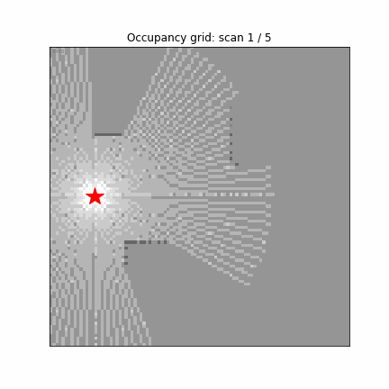</a><br>
<b><a href="notebooks/10_mapping_occupancy_grid.ipynb">Occupancy Grid Building</a></b><br>
<sub>Map fills in scan-by-scan from 5 lidar poses; log-odds accumulate cell-wise evidence.</sub>
</td>
<td align="center">
<a href="notebooks/20_modeling_symbolic_pendulum.ipynb">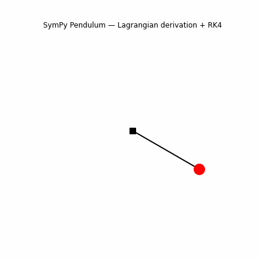</a><br>
<b><a href="notebooks/20_modeling_symbolic_pendulum.ipynb">SymPy Pendulum</a></b><br>
<sub>Lagrangian-derived dynamics integrated with RK4 — energy drift 1e-8 over 10s.</sub>
</td>
</tr>
</table>

## Interactive Demos (pygame)

Four standalone scripts you can drive in real time. See [`demos/`](demos/) for full details.

```bash
pip install pygame
python demos/drive_bicycle.py     # arrow keys: throttle + steer
python demos/fly_quadrotor.py     # arrow keys: thrust + roll
python demos/click_to_plan.py     # paint obstacles, A* replans live
python demos/move_arm.py          # mouse controls end-effector via IK
```

## Quick start (notebooks)

```bash
git clone https://github.com/d8maldon/awesome-python-robotics
cd awesome-python-robotics
pip install -r requirements.txt
jupyter notebook notebooks/
```

| # | Notebook | Section |
|---|---|---|
| 01 | [A* path planning](notebooks/01_motion_planning_astar.ipynb) | Motion Planning |
| 02 | [RRT](notebooks/02_motion_planning_rrt.ipynb) | Motion Planning |
| 03 | [Extended Kalman Filter localization](notebooks/03_localization_ekf.ipynb) | Localization |
| 04 | [Particle filter localization](notebooks/04_localization_particle_filter.ipynb) | Localization |
| 05 | [LQR triple-link inverted pendulum](notebooks/05_motion_control_pendulum_lqr.ipynb) | Motion Control |
| 06 | [Pure pursuit path tracking](notebooks/06_path_tracking_pure_pursuit.ipynb) | Path Tracking |
| 07 | [2-link analytical IK](notebooks/07_manipulation_ik_2link.ipynb) | Manipulation |
| 08 | [Quadrotor PID](notebooks/08_uav_quadrotor_pid.ipynb) | UAV |
| 09 | [Lane detection with OpenCV](notebooks/09_perception_lane_detection.ipynb) | Automated Driving |
| 10 | [2D occupancy grid from lidar](notebooks/10_mapping_occupancy_grid.ipynb) | Mapping |
| 11 | [ICP scan matching](notebooks/11_slam_icp.ipynb) | SLAM |
| 12 | [EKF SLAM](notebooks/12_slam_ekf_slam.ipynb) | SLAM |
| 13 | [Dijkstra](notebooks/13_motion_planning_dijkstra.ipynb) | Motion Planning |
| 14 | [Dynamic Window Approach](notebooks/14_motion_planning_dwa.ipynb) | Motion Planning |
| 15 | [Stanley path tracking](notebooks/15_path_tracking_stanley.ipynb) | Path Tracking |
| 16 | [Jacobian-based 3-link IK](notebooks/16_manipulation_jacobian_ik.ipynb) | Manipulation |
| 17 | [ORB feature matching](notebooks/17_perception_orb_features.ipynb) | Perception |
| 18 | [Kalman target tracking](notebooks/18_perception_kalman_tracking.ipynb) | Perception |
| 19 | [Kinematic bicycle model](notebooks/19_ground_vehicles_bicycle.ipynb) | Ground Vehicles |
| 20 | [Symbolic Lagrangian dynamics (SymPy)](notebooks/20_modeling_symbolic_pendulum.ipynb) | Robot Modeling |
| 21 | [MPC for cart-pole](notebooks/21_motion_control_mpc_cartpole.ipynb) | Motion Control |
| 22 | [CBF safety filter](notebooks/22_motion_control_cbf_safety_filter.ipynb) | Motion Control |

To regenerate from the source script: `python scripts/build_notebooks.py` (then `jupyter nbconvert --to notebook --execute --inplace notebooks/*.ipynb` to refresh plots).

## Contents

- [**By Application Areas**](#by-application-areas)
  - [Ground Vehicles and Mobile Robotics](#ground-vehicles-and-mobile-robotics)
  - [Manipulation](#manipulation)
  - [Legged Locomotion](#legged-locomotion)
  - [Robot Modeling](#robot-modeling)
  - [Perception](#perception)
  - [Mapping, Localization and SLAM](#mapping-localization-and-slam)
  - [Motion Planning and Path Planning](#motion-planning-and-path-planning)
  - [Motion Control](#motion-control)
  - [Unmanned Aerial Vehicles (UAV)](#unmanned-aerial-vehicles-uav)
  - [Marine Robotics & AUV](#marine-robotics--auv)
  - [Automated Driving](#automated-driving)
- [**By Common Tools**](#by-common-tools)
  - [Simulators](#simulators)
  - [ROS and Middleware](#ros-and-middleware)
  - [Hardware and Connectivity](#hardware-and-connectivity)
- [**By Relevant Python Libraries**](#by-relevant-python-libraries)
- [Contributing](#contributing)
- [License](#license)

---

# By Application Areas

## Ground Vehicles and Mobile Robotics

- [PythonRobotics](https://github.com/AtsushiSakai/PythonRobotics) — Python sample codes for robotics algorithms (mobile robots, planning, localization, SLAM).
- [Nav2](https://github.com/ros-navigation/navigation2) — ROS 2 navigation stack for mobile robots with Python launch and behavior tree bindings.
- [PyRoboSim](https://github.com/sea-bass/pyrobosim) — Python-based ROS 2 enabled 2D mobile robot simulator for prototyping high-level behaviors.
- [TurtleBot3 Python examples](https://github.com/ROBOTIS-GIT/turtlebot3) — Reference Python nodes for the TurtleBot3 mobile robot platform.
- [Webots Python API](https://github.com/cyberbotics/webots) — Mobile robot simulation with full Python controller bindings.
- [Crazyswarm](https://github.com/USC-ACTLab/crazyswarm) — Python toolkit for controlling fleets of Crazyflie ground/aerial robots.
- [PyBullet differential drive examples](https://github.com/bulletphysics/bullet3) — Reference mobile-robot examples shipped with PyBullet.
- [Husky / Jackal ROS Python interfaces](https://github.com/husky/husky) — Clearpath Robotics Python interfaces for Husky and Jackal UGVs.
- Mapping, Localization, and SLAM (*See Section Below*)
- Motion Planning and Path Planning (*See Section Below*)
- [PettingZoo](https://github.com/Farama-Foundation/PettingZoo) — Multi-agent RL environments useful for robot swarm research.
- [Open-RMF](https://github.com/open-rmf/rmf) — Open Robotics Middleware Framework for multi-robot fleet management (warehouses, hospitals) with Python bindings.
- [terrain-navigation](https://github.com/ethz-asl/terrain-navigation) — ETH Zurich ASL stack for safe terrain-aware navigation of off-road and aerial vehicles.
- [agri_gaia](https://github.com/agri-gaia) — Open platform for agricultural robotics (in-field tractors, vineyard navigation, crop monitoring) with Python ROS components.

## Manipulation

- [Robotics Toolbox for Python](https://github.com/petercorke/robotics-toolbox-python) — Peter Corke's full-featured manipulator kinematics, dynamics, and control toolbox.
- [MoveIt 2 Python bindings (`moveit_py`)](https://github.com/moveit/moveit2) — Python interface to the MoveIt motion-planning framework.
- [ikpy](https://github.com/Phylliade/ikpy) — Pure-Python inverse kinematics library supporting URDF chains.
- [kinpy](https://github.com/neka-nat/kinpy) — Forward kinematics in Python from URDF/MJCF/SDF descriptions.
- [Pinocchio (Python bindings)](https://github.com/stack-of-tasks/pinocchio) — Fast rigid-body dynamics with Python API; used heavily for manipulator IK/ID.
- [TRAC-IK Python](https://bitbucket.org/traclabs/trac_ik) — Real-time inverse kinematics solver with Python wrappers.
- [python-fcl](https://github.com/BerkeleyAutomation/python-fcl) — Python bindings to the Flexible Collision Library for self-collision and scene-collision checking.
- [panda-py](https://github.com/JeanElsner/panda-py) — Real-time Python control of Franka Emika Panda arms including impedance control modes.
- [dqrobotics (Python)](https://github.com/dqrobotics/python) — Dual-quaternion robotics: modeling and control of serial and parallel manipulators.
- [robosuite](https://github.com/ARISE-Initiative/robosuite) — MuJoCo-based simulation framework for manipulation research.
- [robomimic](https://github.com/ARISE-Initiative/robomimic) — Imitation-learning datasets, environments, and algorithms for manipulators.
- [PyBullet pick-and-place examples](https://github.com/google-research/ravens) — Ravens benchmarks: Transporter-style pick-and-place in PyBullet.

## Legged Locomotion

- [legged_gym](https://github.com/leggedrobotics/legged_gym) — Isaac Gym environments for training quadruped locomotion policies.
- [Walk-These-Ways](https://github.com/Improbable-AI/walk-these-ways) — Multiplicity of behaviors training pipeline for Unitree Go1.
- [Unitree SDK (Python)](https://github.com/unitreerobotics/unitree_sdk2_python) — Official Python SDK for Unitree quadrupeds (Go2, B2, H1).
- [quad-sdk](https://github.com/robomechanics/quad-sdk) — Open quadruped control stack with Python utilities.
- [Brax](https://github.com/google/brax) — Differentiable physics engine in JAX for fast legged-robot policy training.
- [Cassie MuJoCo Sim](https://github.com/osudrl/cassie-mujoco-sim) — MuJoCo simulation of Agility Robotics' Cassie biped with Python API.
- [Crocoddyl](https://github.com/loco-3d/crocoddyl) — Differential dynamic programming for legged-robot trajectory optimization with Python API.
- [pymanoid](https://github.com/stephane-caron/pymanoid) — Humanoid robotics in Python: LIPM-based walking pattern generation and centroidal control.
- [rsl_rl](https://github.com/leggedrobotics/rsl_rl) — Fast RL implementations (PPO, DDPG variants) used to train quadruped locomotion policies.

## Robot Modeling

- [urdfpy / urchin](https://github.com/fishbotics/urchin) — Parse, visualize, and manipulate URDF files in Python.
- [yourdfpy](https://github.com/clemense/yourdfpy) — Modern Python URDF parser with mesh handling.
- [Drake (Python bindings)](https://github.com/RobotLocomotion/drake) — Toyota Research Institute's planning/control/simulation toolbox with full `pydrake` API.
- [MuJoCo (Python bindings)](https://github.com/google-deepmind/mujoco) — DeepMind's general-purpose physics simulator with first-class Python support.
- [PyBullet](https://github.com/bulletphysics/bullet3) — Real-time physics simulation with URDF / SDF / MJCF import.
- [OMPython](https://github.com/OpenModelica/OMPython) — Python interface to OpenModelica, the open-source equivalent of Simscape for symbolic multi-domain physical modeling (mechanical, hydraulic, electrical).
- [BondGraphTools](https://github.com/BondGraphTools/BondGraphTools) — Symbolic bond-graph modeling of multi-physics systems in Python — closest analog to Simscape's acausal modeling paradigm.
- [CadQuery](https://github.com/CadQuery/cadquery) — Parametric CAD scripted in Python; export to STEP/STL/URDF for robot modeling.
- [onshape-to-robot](https://github.com/Rhoban/onshape-to-robot) — Convert Onshape CAD assemblies into URDF/SDF robot models from Python.

## Perception

- [OpenCV-Python](https://github.com/opencv/opencv-python) — Computer vision primitives, feature detection, calibration, tracking.
- [Open3D](https://github.com/isl-org/Open3D) — Modern 3D data processing: point clouds, meshes, RGB-D, registration.
- [PyTorch3D](https://github.com/facebookresearch/pytorch3d) — Differentiable 3D vision library from Meta AI.
- [MMDetection3D](https://github.com/open-mmlab/mmdetection3d) — OpenMMLab toolbox for 3D object detection from point clouds and images.
- [Detectron2](https://github.com/facebookresearch/detectron2) — Meta AI's object detection / segmentation platform.
- [DepthAI Python](https://github.com/luxonis/depthai-python) — Luxonis OAK stereo + neural-inference camera Python API.
- [pyrealsense2](https://github.com/IntelRealSense/librealsense) — Intel RealSense depth-camera Python bindings.
- [filterpy](https://github.com/rlabbe/filterpy) — Kalman and Bayesian filters used widely for inertial sensor fusion.
- [ByteTrack](https://github.com/ifzhang/ByteTrack) — High-performance multi-object tracker using detection-association by IoU + low-score recovery.
- [DeepSORT-realtime](https://github.com/levan92/deep_sort_realtime) — Real-time Python implementation of DeepSORT for appearance-based multi-object tracking.

## Mapping, Localization and SLAM

- [pySLAM](https://github.com/luigifreda/pyslam) — Monocular Visual SLAM framework in Python.
- [ORB-SLAM3 Python bindings](https://github.com/UZ-SLAMLab/ORB_SLAM3) — Reference visual-inertial SLAM with community Python wrappers.
- [GTSAM (Python wrappers)](https://github.com/borglab/gtsam) — Factor-graph optimization library widely used for SLAM back-ends.
- [PyPose](https://github.com/pypose/pypose) — PyTorch-based library for robot learning with SLAM/pose-graph primitives.
- [Nav2 AMCL](https://github.com/ros-navigation/navigation2) — Adaptive Monte Carlo Localization in ROS 2, callable from Python nodes.
- [g2o-python](https://github.com/miquelmassot/g2o-python) — Python bindings for the g2o graph optimizer used in many SLAM back-ends.
- [python-graphslam](https://github.com/JeffLIrion/python-graphslam) — Pure-Python implementation of 2D/3D graph SLAM with pose-graph optimization.
- [KISS-ICP](https://github.com/PRBonn/kiss-icp) — Simple, robust 3D LiDAR odometry with first-class Python API.
- [Cartographer](https://github.com/cartographer-project/cartographer) — Google's real-time 2D/3D LiDAR SLAM, used through `cartographer_ros` with Python launch files.
- [RTAB-Map](https://github.com/introlab/rtabmap) — RGB-D, stereo, and LiDAR SLAM with a built-in map-builder GUI and Python bindings via `rtabmap_ros`.
- [nav2_map_server](https://github.com/ros-navigation/navigation2/tree/main/nav2_map_server) — Occupancy grid load/save/serve utilities for ROS 2, scriptable from Python.
- [grid_map](https://github.com/ANYbotics/grid_map) — ANYbotics' universal multi-layer grid map library for ego-centric near-field maps, usable from Python via ROS bindings.

## Motion Planning and Path Planning

- [OMPL Python bindings](https://github.com/ompl/ompl) — The Open Motion Planning Library with full Python API (RRT, PRM, KPIECE, etc.).
- [PythonRobotics — Path Planning](https://github.com/AtsushiSakai/PythonRobotics#path-planning) — RRT, RRT*, A*, Dijkstra, Hybrid A*, state lattice, model predictive trajectory.
- [MoveIt 2 motion planners](https://github.com/moveit/moveit2) — Manipulator planning (OMPL, CHOMP, STOMP, Pilz) with Python interfaces.
- [pyastar2d](https://github.com/hjweide/pyastar2d) — Fast A* search on 2D grids using a C backend with a Python interface.
- [Dubins-curves](https://github.com/AndrewWalker/pydubins) — Dubins path computation for car-like vehicles.
- [networkx](https://github.com/networkx/networkx) — Graph algorithms used for roadmap construction and graph search.
- [trajopt](https://github.com/personalrobotics/aikido) — Trajectory optimization tooling (within the AIKIDO framework) for manipulation.
- [PythonRobotics — Planning algorithm guide](https://github.com/AtsushiSakai/PythonRobotics#path-planning) — Side-by-side comparison of RRT*, A*, Dijkstra, PRM, Hybrid A*, state-lattice, and MPC trajectory planners to help choose the right algorithm.

## Motion Control

- [python-control](https://github.com/python-control/python-control) — The Python Control Systems Library: state-space, LQR, MPC primitives, PID.
- [do-mpc](https://github.com/do-mpc/do-mpc) — Model predictive control and moving horizon estimation toolbox.
- [CasADi](https://github.com/casadi/casadi) — Symbolic framework for nonlinear optimization and optimal control.
- [simple-pid](https://github.com/m-lundberg/simple-pid) — A minimal PID controller for embedded and prototyping use.
- [Stable-Baselines3](https://github.com/DLR-RM/stable-baselines3) — RL algorithms (DDPG, SAC, PPO) commonly used for learned motion control.
- [TCLab](https://github.com/jckantor/TCLab) — Temperature Control Lab and Python toolkit for hands-on multi-loop PID tuning and process control (BYU/Notre Dame curriculum).

## Unmanned Aerial Vehicles (UAV)

- [pymavlink](https://github.com/ArduPilot/pymavlink) — Python MAVLink protocol implementation for PX4/ArduPilot.
- [DroneKit-Python](https://github.com/dronekit/dronekit-python) — High-level Python API for MAVLink-compatible autopilots.
- [MAVSDK-Python](https://github.com/mavlink/MAVSDK-Python) — Modern asyncio Python bindings to MAVSDK for PX4.
- [gym-pybullet-drones](https://github.com/utiasDSL/gym-pybullet-drones) — Quadrotor simulation and RL environment in PyBullet.
- [crazyflie-lib-python](https://github.com/bitcraze/crazyflie-lib-python) — Official Python library for the Bitcraze Crazyflie nano-quad.
- [AirSim Python API](https://github.com/microsoft/AirSim) — Microsoft AirSim drone & car simulator with Python client.
- [Olympe (Parrot)](https://github.com/Parrot-Developers/olympe) — Parrot's Python controller framework for ANAFI and SPHINX simulator.
- [JSBSim](https://github.com/JSBSim-Team/jsbsim) — Open-source 6-DoF flight dynamics model with Python bindings — the canonical Python tool for high-fidelity fixed-wing UAV simulation, waypoint following, and guidance-model approximation.

## Marine Robotics & AUV

- [HoloOcean](https://github.com/byu-pccl/holoocean) — Underwater robotics simulator built on Unreal Engine with Python API.
- [UUV Simulator](https://github.com/uuvsimulator/uuv_simulator) — Gazebo-based underwater vehicle simulation (Python ROS interfaces).
- [stonefish + stonefish_ros](https://github.com/patrykcieslak/stonefish) — Marine robotics simulator with Python ROS bindings.
- [BlueROV2 (mavlink-router + pymavlink)](https://github.com/bluerobotics/BlueOS) — BlueRobotics BlueROV2 ecosystem with Python tooling.
- [orca4](https://github.com/clydemcqueen/orca4) — Autonomous Underwater Vehicle stack on top of ROS 2 + ArduSub.
- [gym-auv](https://github.com/simentha/gym-auv) — OpenAI Gym environment for AUV path-following with RL.
- [usv_sim](https://github.com/disaster-robotics-proalertas/usv_sim_lsa) — Unmanned Surface Vehicle simulator for autonomous boats.
- [pyroomacoustics](https://github.com/LCAV/pyroomacoustics) — Audio array signal processing including direction-of-arrival (DOA) estimation, applicable to hydrophone arrays on AUVs.
- [SysIdentPy](https://github.com/wilsonrljr/sysidentpy) — Python toolbox for system identification of nonlinear systems — useful for modeling thrusters and AUV dynamics from data.

## Automated Driving

- [CARLA](https://github.com/carla-simulator/carla) — Open-source self-driving simulator with full Python API.
- [openpilot](https://github.com/commaai/openpilot) — comma.ai's open-source driver-assistance system; Python-heavy stack.
- [Autoware Python utilities](https://github.com/autowarefoundation/autoware) — Open-source autonomous driving stack with Python tooling and ROS 2 nodes.
- [Apollo](https://github.com/ApolloAuto/apollo) — Baidu's open autonomous driving platform; Python bindings for perception and planning.
- [nuScenes devkit](https://github.com/nutonomy/nuscenes-devkit) — Python devkit for the nuScenes autonomous-driving dataset.
- [MetaDrive](https://github.com/metadriverse/metadrive) — Lightweight, configurable driving simulator for RL.
- [highway-env](https://github.com/Farama-Foundation/HighwayEnv) — Collection of environments for highway / intersection decision-making research.
- [CVAT](https://github.com/cvat-ai/cvat) — Open-source annotation tool for images and video, widely used to label autonomous-driving datasets for segmentation and detection.
- [AB3DMOT](https://github.com/xinshuoweng/AB3DMOT) — 3D multi-object tracking baseline for track-level fusion of radar/LiDAR/camera detections.
- [OpenPCDet](https://github.com/open-mmlab/OpenPCDet) — OpenMMLab end-to-end LiDAR perception pipeline (point cloud → 3D detections → track list).

---

# By Common Tools

## Simulators

- **ROS-based simulators** (*See Section Below*)
- [PyBullet](https://github.com/bulletphysics/bullet3) — Real-time physics simulator (URDF/SDF/MJCF) with first-class Python.
- [MuJoCo](https://github.com/google-deepmind/mujoco) — DeepMind physics engine with native Python bindings.
- [Webots](https://github.com/cyberbotics/webots) — Mature open-source robotics simulator with Python controllers.
- [NVIDIA Isaac Lab](https://github.com/isaac-sim/IsaacLab) — GPU-accelerated robot learning framework built on Isaac Sim.
- [Gazebo / gz-python](https://github.com/gazebosim/gz-sim) — Modern Gazebo (formerly Ignition) with Python bindings.
- [dm_robotics](https://github.com/google-deepmind/dm_robotics) — DeepMind's curated robotics simulation environments and educational manipulation worlds built on MuJoCo.

## ROS and Middleware

- [rclpy](https://github.com/ros2/rclpy) — Official Python client library for ROS 2.
- [rospy](https://github.com/ros/ros_comm) — Python client library for ROS 1 (Noetic and earlier).
- [roslibpy](https://github.com/gramaziokohler/roslibpy) — Pure-Python ROS bridge via WebSocket (works with ROS 1 & 2).
- [ros2cli](https://github.com/ros2/ros2cli) — Python implementation of the `ros2` command-line tools.
- [Micro-ROS Python tooling](https://github.com/micro-ROS/micro_ros_setup) — Micro-ROS scaffolding scripts in Python for MCU targets.
- [ros2_control](https://github.com/ros-controls/ros2_control) — Real-time control framework usable from Python via `controller_manager`.
- [ROS 2 Python Tutorials](https://docs.ros.org/en/humble/Tutorials.html) — Official getting-started tutorials for writing ROS 2 nodes, services, and actions in Python.

## Hardware and Connectivity

- Any robot running **ROS** (See ROS Section)
- [pyserial](https://github.com/pyserial/pyserial) — Serial communication with Arduino-class microcontrollers and sensors.
- [gpiozero](https://github.com/gpiozero/gpiozero) — Simple GPIO interface for Raspberry Pi.
- [Adafruit Blinka](https://github.com/adafruit/Adafruit_Blinka) — CircuitPython compatibility layer for SBCs like Raspberry Pi and BeagleBone.
- [Dynamixel SDK (Python)](https://github.com/ROBOTIS-GIT/DynamixelSDK) — ROBOTIS Dynamixel servo SDK with Python bindings.
- [pyrealsense2](https://github.com/IntelRealSense/librealsense) — Intel RealSense depth-camera Python bindings.
- [DepthAI Python](https://github.com/luxonis/depthai-python) — Luxonis OAK cameras (RGB + stereo + on-device NN).
- [Kinova Kortex API](https://github.com/Kinovarobotics/kortex) — Python API for Kinova Gen3 manipulators.
- [ur_rtde](https://gitlab.com/sdurobotics/ur_rtde) — Real-Time Data Exchange C++/Python interface for Universal Robots.
- [pybricks-micropython](https://github.com/pybricks/pybricks-micropython) — Python (MicroPython) for LEGO Mindstorms / SPIKE Prime.
- [Adafruit_Python_BBIO](https://github.com/adafruit/adafruit-beaglebone-io-python) — Python I/O library for the BeagleBone family.
- [tmc_wrs_gazebo](https://github.com/hsr-project/tmc_wrs_gazebo) — Gazebo simulation and Python ROS interfaces for the Toyota Human Support Robot (HSR).
- [VEXcode Python](https://www.vexrobotics.com/vexcode) — Official Python development environment for VEX V5 / IQ / EXP robotics platforms.

---

# By Relevant Python Libraries

- [PythonRobotics](https://github.com/AtsushiSakai/PythonRobotics) — Reference implementations of classic robotics algorithms.
- [Robotics Toolbox for Python](https://github.com/petercorke/robotics-toolbox-python) — Peter Corke's manipulator + mobile robot toolbox.
- [ROS 2 / rclpy](https://github.com/ros2/rclpy) — Python client library for ROS 2.
- [Drake (`pydrake`)](https://github.com/RobotLocomotion/drake) — Planning, control, and analysis from TRI.
- [Pinocchio](https://github.com/stack-of-tasks/pinocchio) — Fast rigid-body dynamics algorithms.
- [MuJoCo](https://github.com/google-deepmind/mujoco) — DeepMind's physics engine.
- [PyBullet](https://github.com/bulletphysics/bullet3) — Real-time physics simulation.
- [Open3D](https://github.com/isl-org/Open3D) — 3D data processing and visualization.
- [OpenCV-Python](https://github.com/opencv/opencv-python) — Computer vision primitives.
- [PyTorch](https://github.com/pytorch/pytorch) — Deep-learning framework used across modern perception and policy work.
- [Stable-Baselines3](https://github.com/DLR-RM/stable-baselines3) — Reliable PyTorch implementations of RL algorithms.
- [python-control](https://github.com/python-control/python-control) — Python Control Systems Library.
- [CasADi](https://github.com/casadi/casadi) — Symbolic framework for nonlinear optimization & optimal control.
- [Gymnasium](https://github.com/Farama-Foundation/Gymnasium) — Maintained successor to OpenAI Gym for RL environments.
- [esmini](https://github.com/esmini/esmini) — Open-source OpenSCENARIO player for designing driving scenarios; closest open equivalent to MathWorks RoadRunner with Python bindings.

---

## Contributing

Pull requests welcome. See [CONTRIBUTING.md](CONTRIBUTING.md) for guidelines. Add new entries in alphabetical order within their section, link to the canonical project page, and keep descriptions under one line.

## License

[](https://creativecommons.org/publicdomain/zero/1.0/)

To the extent possible under law, this list is released into the public domain under [CC0 1.0](LICENSE).
